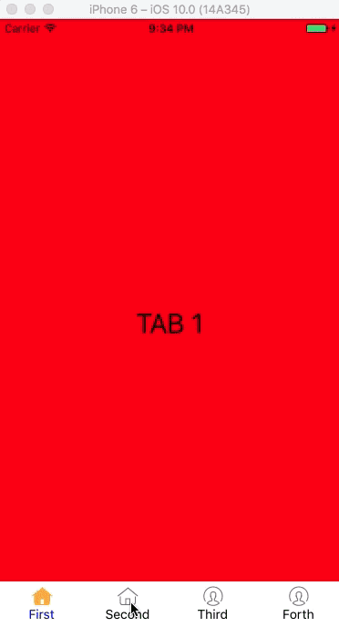

# react-native-tabs
React Native platform-independent tabs. Originally forked form https://github.com/aksonov/react-native-tabs.

## Why I need to use it?
I'm developing an app which needs to run on both iOS and Android with bottom tabs. Obviously React Native does not provide Android one, and the forked one can not work as I need.

So I develop one based on the forked one.

## How it works?
I'm trying to make this tab works just like the React Native TabBarIOS. Similar API will cost you less time to integrate it.

## Example
Example makes selected icon color red and change the state of example view. To switch to other views you may use react-native-router-flux component or own navigation controller



```javascript
import React from 'react';
import {
  AppRegistry,
  StyleSheet,
  Text,
  View,
  Image
} from "react-native";

import Tabs from './Lib/TabCore';
// import Tabs from './lib/test';

// type State = {
//   page: string
// };

export default class Example extends React.Component {
  state: {
    selectedTab: string
  };

  constructor(props: any) {
    super(props);
    this.state = {
      selectedTab: 'first'
    };
  }

  render() {
    var self = this;
    return (
      <Tabs selected={this.state.selectedTab} style={{ backgroundColor: 'white' }}
        selectedStyle={{}} onSelect={el => this.setState({ page: el.props.name }) }
        pressOpacity={1}>
        <Tabs.Item
          icon={require('./images/Home@2x.png')}
          selectedIcon={require('./images/Home_selected@2x.png')}
          title='First'
          selected={this.state.selectedTab === 'first'}
          onPress={() => {
            this.setState({selectedTab: 'first'});
          }}>
          <View style={[styles.container, {flex: 1, backgroundColor:'red'}]}>
            <Text style={{fontSize: 30}}>TAB 1</Text>
          </View>
        </Tabs.Item>
        {/* <Text name="second" selectedIconStyle={{ borderTopWidth: 2, borderTopColor: 'red' }}>Second</Text> */}
        <Tabs.Item
          icon={require('./images/Home@2x.png')}
          selectedIcon={require('./images/Home_selected@2x.png')}
          title='Second'
          selected={this.state.selectedTab === 'second'}
          onPress={() => {
            this.setState({selectedTab: 'second'});
          }}>
          <View style={[styles.container, {flex: 1, backgroundColor:'blue'}]}>
            <Text style={{fontSize: 30, color: 'white'}}>TAB 2</Text>
          </View>
        </Tabs.Item>
        <Tabs.Item
          icon={require('./images/Account@2x.png')}
          selectedIcon={require('./images/Account_selected@2x.png')}
          title='Third'
          selected={this.state.selectedTab === 'third'}
          onPress={() => {
            this.setState({selectedTab: 'third'});
          }}>
          <View style={[styles.container, {flex: 1, backgroundColor:'green'}]}>
            <Text style={{fontSize: 30}}>TAB 3</Text>
          </View>
        </Tabs.Item>
        <Tabs.Item
          icon={require('./images/Account@2x.png')}
          selectedIcon={require('./images/Account_selected@2x.png')}
          title='Forth'
          selected={this.state.selectedTab === 'forth'}
          onPress={() => {
            this.setState({selectedTab: 'forth'});
          }}>
          <View style={[styles.container, {flex: 1, backgroundColor:'orange'}]}>
            <Text style={{fontSize: 30}}>TAB 4</Text>
          </View>
        </Tabs.Item>
        {/* <View name="fifth">
          <Image style={{width:30, height:30}} source={require("./images/Account@2x.png")}/>
          <Text>First</Text>
        </View> */}
      </Tabs>
    );
  }
}

var styles = StyleSheet.create({
  container: {
    flex: 1,
    justifyContent: 'center',
    alignItems: 'center',
    backgroundColor: '#F5FCFF',
  },
  welcome: {
    fontSize: 20,
    textAlign: 'center',
    margin: 10,
  },
  instructions: {
    textAlign: 'center',
    color: '#333333',
    marginBottom: 5,
  },
});

AppRegistry.registerComponent('Example', () => Example);

```
